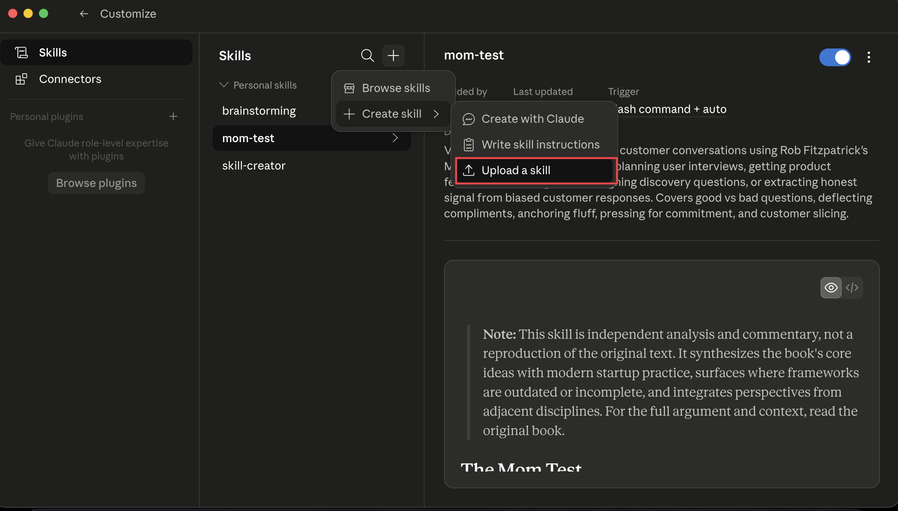

# claude-desktop-skills

CLI tool that packages skills from GitHub repos into `.skill` files for Claude Desktop.

## Prerequisites

- [Node.js](https://nodejs.org/) (v18+)
- [Git](https://git-scm.com/)

## Quick Start

```bash
npx claude-desktop-skills pack <owner/repo>
```

Then upload in Claude Desktop: **Customize → Skills → + → Create skill → Upload a skill**



Works with `npx` and `bunx`.

## Commands

```bash
# Pack all skills from a repo
npx claude-desktop-skills pack <owner/repo>

# Pack a specific skill only
npx claude-desktop-skills pack <owner/repo> --skill <skill-name>

# Custom output directory
npx claude-desktop-skills pack <owner/repo> --output ./my-skills

# List skills in a repo (without packing)
npx claude-desktop-skills list <owner/repo>

# Search across cached repos
npx claude-desktop-skills find <query>
```

Output goes to `skills-pack/<repo>-<timestamp>/` with a README and all `.skill` files.

## Install globally (optional)

```bash
npm install -g claude-desktop-skills
```

## How it works

1. Clones the GitHub repo locally (temp, removed after packing)
2. Scans for directories containing `SKILL.md`
3. Extracts name/description from YAML frontmatter
4. Zips each skill folder into a `.skill` file (the format Claude Desktop expects)

## Why not `npx skills`?

[`vercel-labs/skills`](https://github.com/vercel-labs/skills) is a general-purpose skill manager for 55+ AI coding agents (Claude Code, Cursor, Copilot, etc.). It installs skills by symlinking into agent-specific directories like `.claude/skills/`.

**claude-desktop-skills solves a different problem** — it targets **Claude Desktop**, which doesn't read from `.claude/skills/`. Claude Desktop requires `.skill` files uploaded through its UI. No other tool produces this format.

| | claude-desktop-skills | vercel-labs/skills |
|---|---|---|
| Target | Claude Desktop | Claude Code + 55 agents |
| Output | `.skill` zip files for upload | Symlinks to agent directories |
| Workflow | `npx claude-desktop-skills pack` → upload in UI | `npx skills add` → ready to use |
| Unique value | Only tool that produces `.skill` format | Multi-agent support |

**TL;DR** — Use `vercel-labs/skills` if you're in Claude Code or other coding agents. Use `claude-desktop-skills` if you need skills in **Claude Desktop**.
